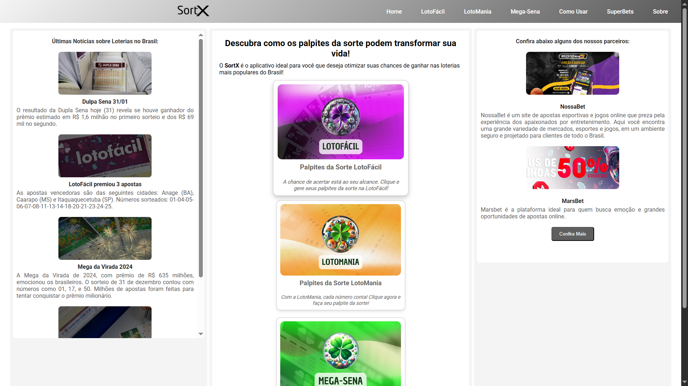

# Wander Augusto | Desenvolvedor de Software

Olá! Sou um profissional de tecnologia em transição de carreira, migrando de uma sólida trajetória em **Infraestrutura de TI** para o universo do **Desenvolvimento de Software Fullstack**. Minha bagagem como Analista de TI me proporcionou uma visão sistêmica sobre ambientes corporativos, redes e suporte, que hoje integro com as tecnologias mais modernas de desenvolvimento web e mobile.

Atualmente, meu foco é construir soluções práticas e eficientes, aplicando meus conhecimentos em **Node.js**, **React Native**, **ReactJS** e **criação de APIs**. Busco minha primeira oportunidade como **Desenvolvedor Júnior**, para colaborar com equipes inovadoras, resolver problemas complexos e continuar em constante aprendizado.

---

## 🚀 Projetos em Destaque

Aqui estão alguns dos projetos que desenvolvi para aplicar e aprimorar minhas habilidades em desenvolvimento mobile e web.

### 🖋️ Sistema de Assinatura Digital de Atendimento – 4º Registro de Imóveis de Belo Horizonte (4RIBH)

**Descrição:**  
Sistema web desenvolvido para o **4º Registro de Imóveis de Belo Horizonte (4RIBH)**, com o objetivo de **modernizar o atendimento ao público**, **agilizar os processos internos** e, principalmente, **promover a sustentabilidade por meio da redução do uso de papel**.

O fluxo funciona da seguinte forma: o atendente, no computador, seleciona o guichê em que está atendendo. O tablet posicionado no balcão é então sincronizado com esse mesmo guichê. Após isso, o atendente insere os dados do cliente (**nome**, **número do protocolo/atendimento** e **e-mail**) e envia essas informações **em tempo real** para o tablet.

No tablet, o cliente **preenche um formulário digital** e **realiza sua assinatura eletrônica**, eliminando a necessidade de formulários impressos.

**Impacto sustentável:**  
Este sistema foi criado com o propósito de **reduzir o desperdício de papel**, **minimizando o impacto ambiental da serventia**. Além de ser uma solução tecnológica, é uma **iniciativa alinhada com práticas mais sustentáveis e conscientes**.

**Funcionalidades principais:**

- ✅ Sincronização em tempo real entre computador e tablet via **WebSocket**
- ✅ Gerenciamento simultâneo de múltiplos guichês
- ✅ Formulário dinâmico, adaptável a diferentes tipos de serviços
- ✅ Notificações instantâneas ao atendente ao final de cada assinatura
- ✅ Eliminação do uso de papel, com armazenamento totalmente digital dos dados e assinaturas

**Tecnologias utilizadas:**

- **Frontend Web:** ReactJS com **CSS Modules**
- **Frontend Mobile/Tablet:** React Native com **CSS Modules**
- **Gerenciamento de estado:** React Context API
- **Comunicação em tempo real:** WebSocket
- **Backend/API:** Node.js com WebSocket Server

**Imagem (Exemplo Ilustrativo):**  

  

---

### 📇 Agenda Eletrônica – Sistema de Contatos Internos e Externos

- **Descrição:** Sistema web desenvolvido com **ReactJS + Vite** para centralizar e organizar os contatos da serventia (cartório), bem como os dados de clientes e parceiros externos.

- **Funcionalidades principais:**
  - Cadastro, edição e remoção de contatos de clientes/parceiros com nome, e-mail, telefone e campo de observação.
  - Consulta rápida de nomes, ramais e e-mails dos colaboradores internos.
  - Busca eficiente por nome ou telefone.
  - Interface responsiva e performática, otimizada com Vite.
  - Uso consistente de **CSS Modules** para modularidade e manutenção do estilo.

- **Tecnologias utilizadas:**
  - **Frontend:** ReactJS + Vite com CSS Modules
  - **Gerenciamento de estado:** React Context API
  - **Persistência:** JSON local (com possibilidade de backend futuro)

  
### 🎯 SortX - Plataforma de Loterias
**Descrição:**  
O **SortX** é um portal completo e intuitivo para quem gosta de apostar nas loterias mais populares do Brasil, como **LotoFácil**, **Mega-Sena** e **LotoMania**. A plataforma permite ao usuário **gerar combinações de números**, **salvar palpites favoritos** e **consultar os resultados mais recentes** das loterias.  

Além de funcionar como site, o SortX também é uma **aplicação mobile progressiva (PWA)**, podendo ser adicionada diretamente à tela inicial do dispositivo, facilitando o acesso rápido e prático.

**Funcionalidades principais:**  
- **Gerar Palpites:** Crie combinações de números da sorte com apenas um clique. Caso goste de um palpite, o usuário pode **salvar** para consulta futura.  
- **Palpites Salvos:** Uma tela dedicada onde o usuário pode visualizar e gerenciar todos os seus palpites favoritos salvos anteriormente.  
- **Resultados das Loterias:** Consulte o resultado mais recente da loteria escolhida e também acesse os concursos anteriores para planejar futuras apostas.

**Por que usar o SortX?**  
O site é ideal para quem busca **praticidade, eficiência e inovação** nas apostas. Com poucos cliques, o usuário consegue **gerar combinações inteligentes**, **acompanhar resultados oficiais** e **organizar seus palpites** de forma simples e rápida.

**Tecnologias utilizadas:** HTML, CSS, JavaScript, Node.js
- **Imagem:**  
 

  

- **Acesso:**  
  [Acesse o site www.sortx.com.br](https://www.sortx.com.br)

---

---
## 🎨 Projetos Pessoais & Hobbies

Além do meu trabalho profissional, mantenho um site pessoal chamado **[Orações Vampíricas](https://www.oracoesvampiricas.com.br)**, que é uma plataforma dedicada a um nicho específico, onde aplico minhas habilidades em desenvolvimento web, SEO e marketing digital. Esse projeto me permite explorar minha criatividade e paixão por conteúdos diferenciados, ao mesmo tempo que aprimoro técnicas essenciais para criação e manutenção de sites.

---

## 💻 Tecnologias e Competências

Minha combinação de experiência em infraestrutura e novas habilidades em desenvolvimento me permite criar soluções robustas e completas.

### Hard Skills

- **Backend:** Node.js, Criação de APIs REST/RESTful
- **Mobile:** React Native com CSS Modules
- **Frontend:** ReactJS com CSS Modules, HTML5, CSS3, JavaScript
- **Infraestrutura e Redes:** Gestão de Servidores, Ambientes Corporativos, Segurança de Redes
- **Bancos de Dados:** MySQL, PostgreSQL, MongoDB
- **Ferramentas:** Git, GitHub, VS Code, Docker

### Soft Skills

- **Resolução de Problemas:** Criatividade e pensamento analítico para encontrar soluções eficientes.
- **Trabalho em Equipe:** Experiência em colaborar com times multidisciplinares para atingir objetivos comuns.
- **Gestão de Tempo:** Organização e disciplina para lidar com prazos e múltiplas tarefas.
- **Empatia:** Capacidade de compreender as dores e necessidades do usuário final.

---
## 🎓 Formação e Aprendizado Contínuo

Acredito que a tecnologia está em constante evolução, e o aprendizado contínuo é a chave para se manter relevante.

- **Superior em Gestão da Tecnologia da Informação**  
  *Instituição:* UNIBH  
  *Status:* Concluído

- **Pós-Graduação em Gerenciamento de Projetos em TI**  
  *Instituição:* POSAVM 
  *Status:* Concluído

- **Pós-Graduação em Desenvolvimento Fullstack Mobile**  
  *Instituição:* Cotemig - BH  
  *Status:* Concluído

- **Bootcamp Fullstack Mobile**  
  *Plataforma:* DIO (Digital Innovation One)  
  *Status:* Participante ativo

- **Estudos Atuais:** Aprofundando em **Inteligência Artificial** e ferramentas emergentes para otimizar o desenvolvimento de software.

---
- **certificado em ITIL Foundation Certificate in IT Service Management**  
  *Instituição: Prometric  

## 📫 Contato

Estou aberto a novas oportunidades, desafios e parcerias. Vamos conversar sobre tecnologia e como podemos criar algo incrível juntos!

- **LinkedIn:** [https://www.linkedin.com/in/wander-augusto/](https://www.linkedin.com/in/wander-augusto/)
- **Email:** [wasappsbrasil@gmail.com](mailto:wasappsbrasil@gmail.com)
